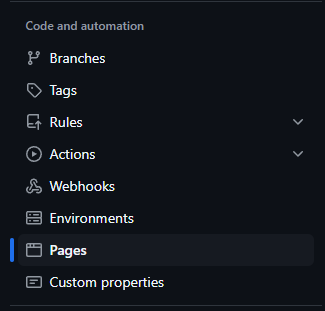
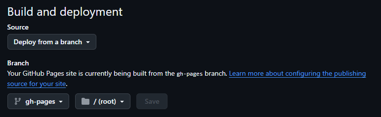

# Deployment Guide

## Public Repository

If your repository is **public**, you can easily deploy your documentation using **GitHub Pages**. Here's how:

### 1. MkDocs Configuration

Make sure to run `mkdocs` from the config path:

```bash
mkdocs build -f mkdocs.yml
```

Inside `mkdocs.yml`, confirm:

```yaml
site_dir: site
```

Use the built-in deploy command:

```bash
mkdocs gh-deploy
```

Make sure `site/` is ignored on `.gitignore` (you don’t need to commit it).

### 2. Navigate to Repository Settings

Go to your repository and click on the **Settings** tab.


### 3. Open the Pages Settings

Scroll down the left-hand sidebar and select **Pages**.



### 4. Configure the Source

Under the **Build and deployment** section:

* Set the **Source** to `Deploy from a branch`
* Select the `gh-pages` branch
* Click **Save**



After saving, GitHub will automatically trigger a **GitHub Action** that builds and deploys your documentation.

---

## Private Repository

If your repository is **private**, GitHub Pages might not be an option depending on your plan. In this case, you can run the documentation locally.

```bash
mkdocs serve
```

This will start a development server. Open your browser and visit:

```cpp
http://127.0.0.1:8000
```

You'll be able to preview and navigate through the documentation in real time.

---

## Further Examples

To see a real implementation example using this setup, check out the documentation inside the [FilterComp](https://github.com/Safe-Solutions-Engenharia/filtercomp) project.